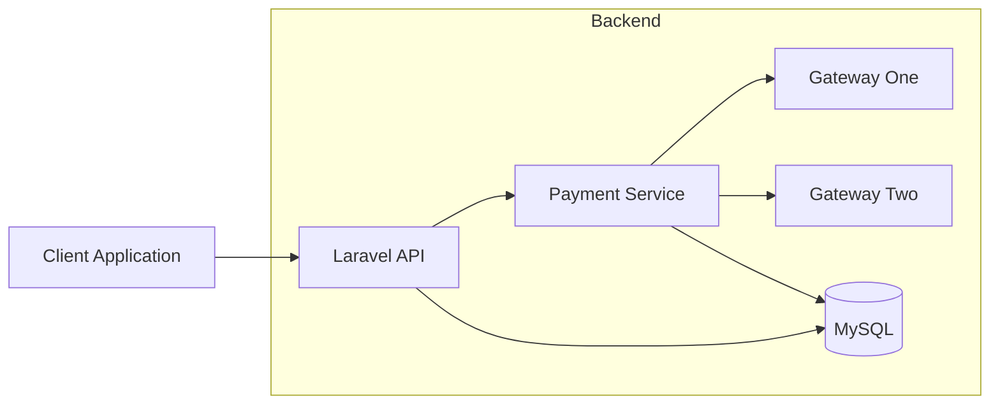
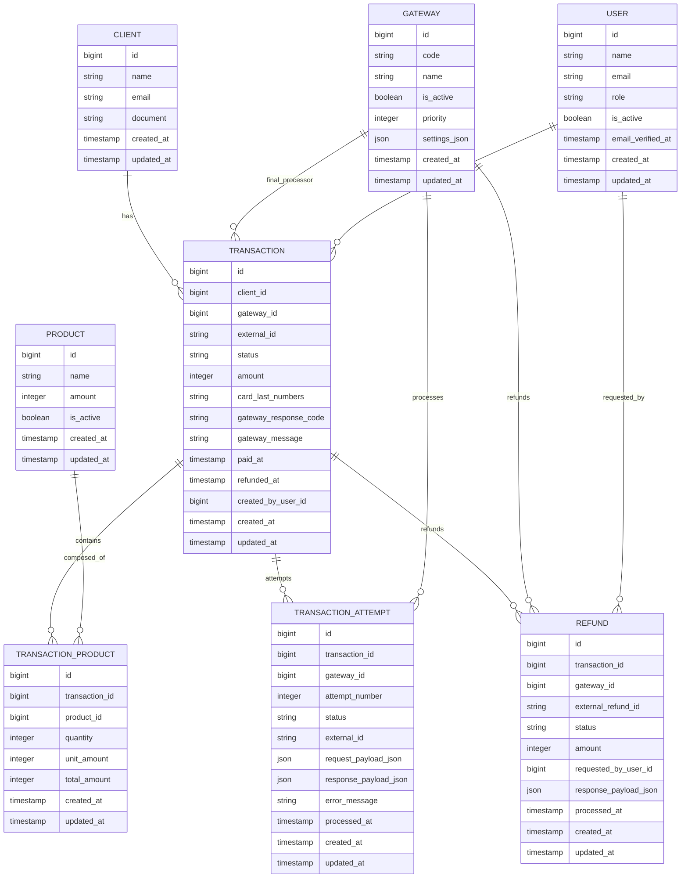
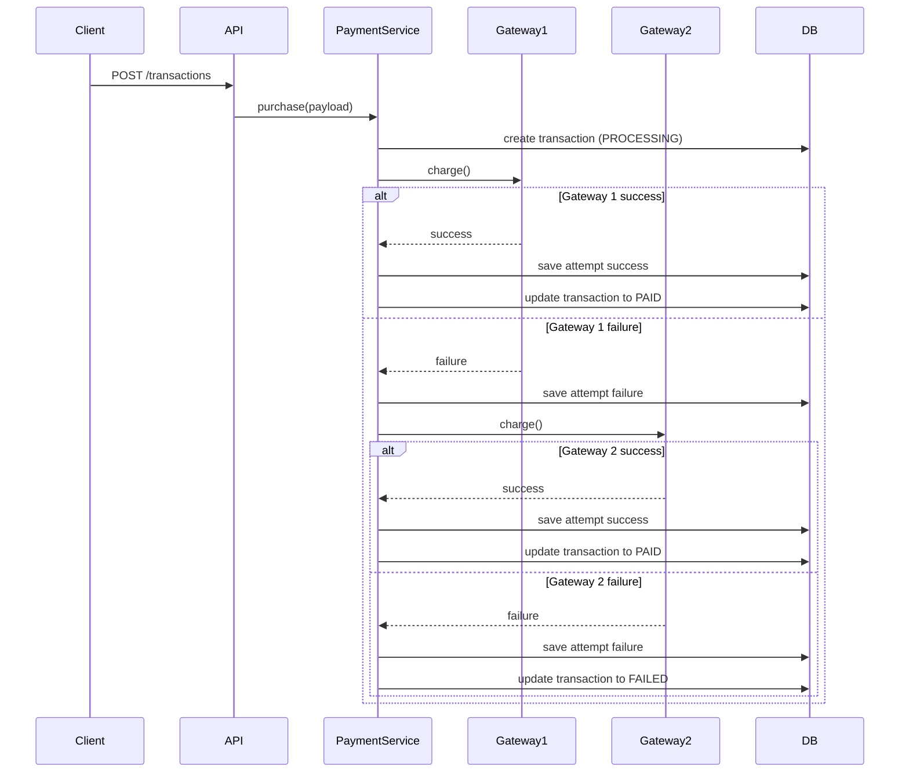
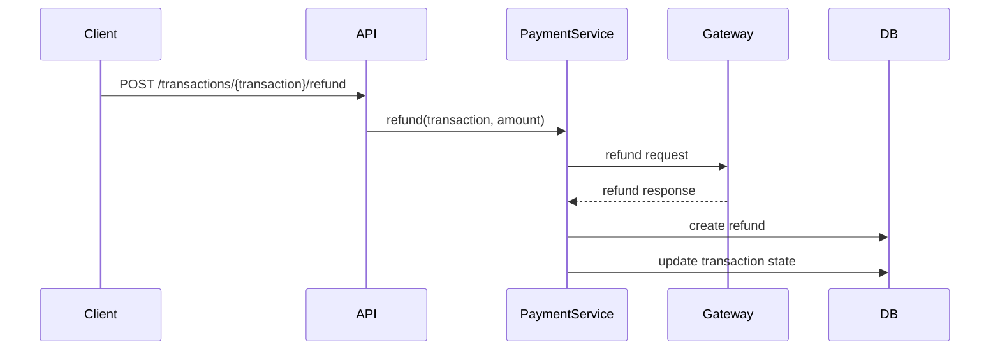

# BeMobile Backend Challenge


API RESTful desenvolvida como solução para o **Teste Prático Backend da BeMobile — Nível 3**.

Este projeto implementa um sistema de **processamento de pagamentos resiliente**, com suporte a múltiplos gateways, fallback automático, auditoria completa de tentativas, controle de permissões por perfil e reembolso total ou parcial.

A solução foi construída com foco em:

- arquitetura modular
- separação clara de responsabilidades
- extensibilidade para novos gateways
- resiliência em integrações externas
- segurança no tratamento de dados sensíveis
- rastreabilidade das operações
- testes automatizados

---

# 📚 Sumário

- Visão Geral
- Destaques da Solução
- Arquitetura do Sistema
- Arquitetura em Camadas
- Estrutura do Projeto
- Modelagem do Banco de Dados
- Dicionário das Tabelas
- Diagrama ER
- Fluxo de Pagamento
- Fluxo de Reembolso
- Estratégia de Fallback de Gateways
- Autenticação e Controle de Permissões
- Endpoints da API
- Exemplos de Uso da API
- Testes Automatizados
- Setup do Projeto
- Docker
- Segurança
- Observabilidade
- Escalabilidade
- Decisões Técnicas
- Aderência ao Desafio
- Melhorias Futuras

---

# Visão Geral

A API fornece um backend completo para **gerenciamento de pagamentos com múltiplos gateways**.

Principais funcionalidades implementadas:

- autenticação de usuários
- gerenciamento de usuários
- gerenciamento de produtos
- gerenciamento de gateways
- consulta de clientes
- criação e processamento de transações
- fallback automático entre gateways
- registro de tentativas de pagamento
- reembolsos totais e parciais
- controle de permissões baseado em roles
- auditoria completa do fluxo de pagamento

---

# Destaques da Solução

| Destaque | Descrição |
|---|---|
| Multi-gateway | Processamento com múltiplos provedores de pagamento |
| Fallback automático | Novo gateway é tentado quando o anterior falha |
| Auditoria | Todas as tentativas são registradas |
| Refund | Suporte a reembolso total e parcial |
| Segurança | Mascaramento e sanitização de dados sensíveis |
| Testabilidade | Cobertura automatizada dos fluxos principais |
| Extensibilidade | Contrato para integração de novos gateways |

---

# Arquitetura do Sistema

## Visão de Alto Nível



## Interpretação

- **Client Application**: consumidor da API
- **Laravel API**: camada HTTP e de entrada
- **Payment Service**: núcleo das regras de negócio
- **Gateways**: integrações externas de pagamento
- **MySQL**: persistência transacional

---

# Arquitetura em Camadas

```text
Client Request
      │
      ▼
Controllers
      │
      ▼
Form Requests
      │
      ▼
Service Layer
      │
      ▼
Gateway Integration
      │
      ▼
Eloquent ORM
      │
      ▼
MySQL Database
```

| Camada | Responsabilidade |
|---|---|
| Controllers | Entrada HTTP e orquestração |
| Requests | Validação e normalização de payload |
| Services | Regras de negócio |
| Gateways | Integração com provedores externos |
| DTOs | Transporte estruturado de dados |
| Enums | Estados e valores do domínio |
| Models | Persistência com Eloquent |

---

# Estrutura do Projeto

```text
app
├── Contracts
│   └── GatewayPaymentInterface.php
│
├── DataTransferObjects
│   ├── GatewayChargeResult.php
│   ├── GatewayRefundResult.php
│   └── PaymentChargeData.php
│
├── Enums
│   ├── GatewayCodeEnum.php
│   ├── RefundStatusEnum.php
│   ├── TransactionAttemptStatusEnum.php
│   ├── TransactionStatusEnum.php
│   └── UserRoleEnum.php
│
├── Exceptions
│   ├── GatewayIntegrationException.php
│   └── Handler.php
│
├── Http
│   ├── Controllers
│   │   └── Api
│   │       ├── AuthController.php
│   │       ├── ClientController.php
│   │       ├── GatewayController.php
│   │       ├── ProductController.php
│   │       ├── RefundController.php
│   │       ├── TransactionController.php
│   │       └── UserController.php
│   │
│   ├── Middleware
│   │   ├── Authenticate.php
│   │   └── RoleMiddleware.php
│   │
│   ├── Requests
│   │   ├── ClientIndexRequest.php
│   │   ├── GatewayIndexRequest.php
│   │   ├── ProductIndexRequest.php
│   │   ├── SetGatewayActiveRequest.php
│   │   ├── StoreProductRequest.php
│   │   ├── StoreRefundRequest.php
│   │   ├── StoreTransactionRequest.php
│   │   ├── StoreUserRequest.php
│   │   ├── TransactionIndexRequest.php
│   │   ├── UpdateGatewayPriorityRequest.php
│   │   ├── UpdateProductRequest.php
│   │   ├── UpdateUserRequest.php
│   │   └── UserIndexRequest.php
│   │
│   └── Resources
│       ├── ClientDetailResource.php
│       ├── ClientResource.php
│       ├── GatewayResource.php
│       ├── ProductResource.php
│       ├── RefundResource.php
│       ├── TransactionResource.php
│       └── UserResource.php
│
├── Models
│   ├── Client.php
│   ├── Gateway.php
│   ├── Product.php
│   ├── Refund.php
│   ├── Transaction.php
│   ├── TransactionAttempt.php
│   ├── TransactionProduct.php
│   └── User.php
│
└── Services
    ├── Gateways
    │   ├── AbstractGatewayService.php
    │   ├── GatewayOneService.php
    │   └── GatewayTwoService.php
    │
    └── PaymentService.php
```

---

# Modelagem do Banco de Dados

A modelagem foi estruturada para suportar:

- transações com múltiplos itens
- múltiplas tentativas por transação
- fallback entre gateways
- rastreabilidade do resultado de integração
- reembolso total e parcial
- controle de usuários internos com perfis distintos

## Tabelas principais

```text
users
clients
products
gateways
transactions
transaction_products
transaction_attempts
refunds
personal_access_tokens
failed_jobs
password_reset_tokens
```

---

# Dicionário das Tabelas

## `users`

Tabela de usuários internos do sistema.

| Coluna | Tipo lógico | Descrição |
|---|---|---|
| id | bigint | Identificador do usuário |
| name | string | Nome do usuário interno |
| email | string | E-mail usado na autenticação |
| password | string | Senha hasheada |
| role | string | Papel de acesso do usuário |
| is_active | boolean | Flag lógica de ativação |
| email_verified_at | timestamp nullable | Data de verificação de e-mail |
| remember_token | string nullable | Token de sessão persistente |
| created_at | timestamp | Data de criação |
| updated_at | timestamp | Data de atualização |

---

## `clients`

Tabela de clientes finais que realizam compras.

| Coluna | Tipo lógico | Descrição |
|---|---|---|
| id | bigint | Identificador do cliente |
| name | string | Nome do cliente |
| email | string | E-mail do cliente |
| document | string nullable | Documento do cliente, como CPF ou CNPJ |
| created_at | timestamp | Data de criação |
| updated_at | timestamp | Data de atualização |

---

## `products`

Tabela de produtos comercializados.

| Coluna | Tipo lógico | Descrição |
|---|---|---|
| id | bigint | Identificador do produto |
| name | string | Nome comercial do produto |
| amount | integer | Valor do produto em centavos |
| is_active | boolean | Indica se o produto está ativo |
| created_at | timestamp | Data de criação |
| updated_at | timestamp | Data de atualização |

---

## `gateways`

Tabela de gateways de pagamento disponíveis.

| Coluna | Tipo lógico | Descrição |
|---|---|---|
| id | bigint | Identificador do gateway |
| code | string | Código técnico do gateway |
| name | string | Nome legível do gateway |
| is_active | boolean | Define se o gateway pode processar pagamentos |
| priority | integer | Ordem de tentativa no fallback |
| settings_json | json nullable | Configurações adicionais do gateway |
| created_at | timestamp | Data de criação |
| updated_at | timestamp | Data de atualização |

---

## `transactions`

Tabela principal das transações de pagamento.

| Coluna | Tipo lógico | Descrição |
|---|---|---|
| id | bigint | Identificador da transação |
| client_id | bigint | Cliente relacionado |
| gateway_id | bigint nullable | Gateway responsável pelo sucesso final |
| external_id | string nullable | Identificador externo retornado pelo gateway |
| status | string | Status da transação |
| amount | integer | Valor total da transação em centavos |
| card_last_numbers | string nullable | Últimos dígitos do cartão |
| gateway_response_code | string nullable | Código retornado pelo gateway |
| gateway_message | string nullable | Mensagem resumida do gateway |
| paid_at | timestamp nullable | Momento em que a transação foi marcada como paga |
| refunded_at | timestamp nullable | Momento em que a transação foi marcada como reembolsada |
| created_by_user_id | bigint nullable | Usuário interno que originou a operação, quando houver |
| created_at | timestamp | Data de criação |
| updated_at | timestamp | Data de atualização |

---

## `transaction_products`

Tabela de itens da transação.

| Coluna | Tipo lógico | Descrição |
|---|---|---|
| id | bigint | Identificador do item |
| transaction_id | bigint | Transação relacionada |
| product_id | bigint | Produto relacionado |
| quantity | integer | Quantidade adquirida |
| unit_amount | integer | Valor unitário histórico em centavos |
| total_amount | integer | Valor total do item em centavos |
| created_at | timestamp | Data de criação |
| updated_at | timestamp | Data de atualização |

---

## `transaction_attempts`

Tabela de auditoria das tentativas de integração por transação.

| Coluna | Tipo lógico | Descrição |
|---|---|---|
| id | bigint | Identificador da tentativa |
| transaction_id | bigint | Transação relacionada |
| gateway_id | bigint | Gateway utilizado na tentativa |
| attempt_number | integer | Número sequencial da tentativa |
| status | string | Resultado da tentativa |
| external_id | string nullable | Identificador externo retornado pelo gateway |
| request_payload_json | json nullable | Payload mascarado enviado ao gateway |
| response_payload_json | json nullable | Payload de resposta ou erro normalizado |
| error_message | string nullable | Mensagem de erro ou fallback |
| processed_at | timestamp nullable | Momento do processamento da tentativa |
| created_at | timestamp | Data de criação |
| updated_at | timestamp | Data de atualização |

---

## `refunds`

Tabela de reembolsos processados.

| Coluna | Tipo lógico | Descrição |
|---|---|---|
| id | bigint | Identificador do reembolso |
| transaction_id | bigint | Transação reembolsada |
| gateway_id | bigint | Gateway responsável pelo refund |
| external_refund_id | string nullable | Identificador externo do reembolso |
| status | string | Status do reembolso |
| amount | integer | Valor reembolsado em centavos |
| requested_by_user_id | bigint nullable | Usuário interno que solicitou o refund |
| response_payload_json | json nullable | Payload de resposta do gateway |
| processed_at | timestamp nullable | Momento do processamento |
| created_at | timestamp | Data de criação |
| updated_at | timestamp | Data de atualização |

---

## `personal_access_tokens`

Tabela padrão do Sanctum para autenticação por token.

| Coluna | Tipo lógico | Descrição |
|---|---|---|
| id | bigint | Identificador do token |
| tokenable_type | string | Classe do dono do token |
| tokenable_id | bigint | Identificador do dono do token |
| name | string | Nome do token |
| token | string | Hash do token |
| abilities | text/json nullable | Habilidades do token |
| last_used_at | timestamp nullable | Último uso do token |
| expires_at | timestamp nullable | Expiração do token |
| created_at | timestamp | Data de criação |
| updated_at | timestamp | Data de atualização |

---

## `failed_jobs`

Tabela padrão do Laravel para falhas de jobs.

| Coluna | Tipo lógico | Descrição |
|---|---|---|
| id | bigint | Identificador interno |
| uuid | string | Identificador único do job |
| connection | string | Conexão da fila |
| queue | string | Nome da fila |
| payload | longtext | Payload serializado |
| exception | longtext | Exceção da falha |
| failed_at | timestamp | Data da falha |

---

## `password_reset_tokens`

Tabela padrão do Laravel para reset de senha.

| Coluna | Tipo lógico | Descrição |
|---|---|---|
| email | string | E-mail do usuário |
| token | string | Token de redefinição |
| created_at | timestamp nullable | Data de criação |

---

# Diagrama ER



---

# Fluxo de Pagamento



## Resumo do fluxo

1. A API recebe o payload da compra.
2. O payload é validado e normalizado.
3. A transação é criada em estado inicial.
4. O sistema tenta o gateway de maior prioridade.
5. Em caso de falha, o próximo gateway ativo é tentado.
6. Todas as tentativas são registradas.
7. O status final da transação é persistido.

---

# Fluxo de Reembolso



## Resumo do fluxo

1. A API recebe a solicitação de refund.
2. A transação é validada quanto ao status e elegibilidade.
3. O gateway responsável é acionado.
4. O resultado é registrado na tabela `refunds`.
5. O status da transação é atualizado conforme o valor devolvido.

---

# Estratégia de Fallback de Gateways

Caso o gateway principal falhe, o sistema tenta automaticamente o próximo gateway disponível com base na prioridade configurada.

```text
Gateway 1 (priority 1)
        ↓
Gateway 2 (priority 2)
        ↓
Transaction Failed
```

## Regras

- gateways inativos são ignorados
- gateways são processados em ordem crescente de prioridade
- cada tentativa gera um registro em `transaction_attempts`
- o primeiro sucesso encerra o fluxo
- se todos falharem, a transação é marcada como `failed`

---

# Autenticação e Controle de Permissões

Autenticação baseada em **Laravel Sanctum**.

## Roles disponíveis

```text
ADMIN
MANAGER
FINANCE
USER
```

## Matriz de permissões

| Ação | ADMIN | MANAGER | FINANCE | USER |
|---|---|---|---|---|
| Criar usuário | ✔ | ✔ | ✖ | ✖ |
| Criar produto | ✔ | ✔ | ✔ | ✖ |
| Criar cliente | ✔ | ✔ | ✔ | ✔ |
| Criar transação | ✔ | ✔ | ✔ | ✔ |
| Processar refund | ✔ | ✖ | ✔ | ✖ |

---

# Endpoints da API

## Auth

```text
POST /api/v1/login
POST /api/v1/logout
GET /api/v1/user
```

## Users

```text
GET /api/v1/users
GET /api/v1/users/{user}
POST /api/v1/users
PUT /api/v1/users/{user}
PATCH /api/v1/users/{user}
DELETE /api/v1/users/{user}
```

## Products

```text
GET /api/v1/products
GET /api/v1/products/{product}
POST /api/v1/products
PUT /api/v1/products/{product}
PATCH /api/v1/products/{product}
DELETE /api/v1/products/{product}
```

## Clients

```text
GET /api/v1/clients
GET /api/v1/clients/{client}
```

## Gateways

```text
GET /api/v1/gateways
GET /api/v1/gateways/{gateway}
PATCH /api/v1/gateways/{gateway}/priority
PATCH /api/v1/gateways/{gateway}/active
```

## Transactions

```text
POST /api/v1/transactions
GET /api/v1/transactions
GET /api/v1/transactions/{transaction}
```

## Refund

```text
POST /api/v1/transactions/{transaction}/refund
```

---

# Exemplos de Uso da API

## 1. Login

### Request

```http
POST /api/v1/login
Content-Type: application/json
```

```json
{
  "email": "admin@example.com",
  "password": "password"
}
```

### Response

```json
{
  "token": "1|example_personal_access_token",
  "user": {
    "id": 1,
    "name": "Administrator",
    "email": "admin@example.com",
    "role": "ADMIN"
  }
}
```

---

## 2. Criar transação

### Request

```http
POST /api/v1/transactions
Content-Type: application/json
Authorization: Bearer TOKEN
```

```json
{
  "customer": {
    "name": "João Silva",
    "email": "joao@email.com",
    "document": "12345678900"
  },
  "items": [
    {
      "product_id": 1,
      "quantity": 2
    },
    {
      "product_id": 2,
      "quantity": 1
    }
  ],
  "card": {
    "number": "4111111111111111",
    "holder_name": "João Silva",
    "expiration": "12/30",
    "cvv": "123",
    "brand": "visa"
  }
}
```

### Response

```json
{
  "data": {
    "id": 1001,
    "status": "paid",
    "amount": 25000,
    "client": {
      "id": 10,
      "name": "João Silva",
      "email": "joao@email.com"
    },
    "gateway": {
      "id": 1,
      "code": "gateway_1",
      "name": "Gateway One"
    },
    "items": [
      {
        "product_id": 1,
        "quantity": 2,
        "unit_amount": 10000,
        "total_amount": 20000
      },
      {
        "product_id": 2,
        "quantity": 1,
        "unit_amount": 5000,
        "total_amount": 5000
      }
    ],
    "attempts": [
      {
        "gateway": "gateway_1",
        "attempt_number": 1,
        "status": "paid"
      }
    ],
    "refunds": [],
    "created_at": "2026-03-10T14:23:00-03:00"
  }
}
```

---

## 3. Listar transações com filtros

### Request

```http
GET /api/v1/transactions?status=paid&client_id=10&per_page=10
Authorization: Bearer TOKEN
```

### Response

```json
{
  "data": [
    {
      "id": 1001,
      "status": "paid",
      "amount": 25000,
      "client": {
        "id": 10,
        "name": "João Silva"
      },
      "gateway": {
        "id": 1,
        "code": "gateway_1"
      }
    }
  ],
  "links": {
    "first": "http://localhost:9000/api/v1/transactions?page=1",
    "last": "http://localhost:9000/api/v1/transactions?page=1",
    "prev": null,
    "next": null
  },
  "meta": {
    "current_page": 1,
    "per_page": 10,
    "total": 1
  }
}
```

---

## 4. Consultar uma transação

### Request

```http
GET /api/v1/transactions/1001
Authorization: Bearer TOKEN
```

### Response

```json
{
  "data": {
    "id": 1001,
    "status": "paid",
    "amount": 25000,
    "client": {
      "id": 10,
      "name": "João Silva",
      "email": "joao@email.com"
    },
    "gateway": {
      "id": 1,
      "code": "gateway_1",
      "name": "Gateway One"
    },
    "items": [
      {
        "product": {
          "id": 1,
          "name": "Produto A"
        },
        "quantity": 2,
        "unit_amount": 10000,
        "total_amount": 20000
      }
    ],
    "attempts": [
      {
        "gateway": {
          "id": 1,
          "code": "gateway_1"
        },
        "attempt_number": 1,
        "status": "paid",
        "processed_at": "2026-03-10T14:23:01-03:00"
      }
    ],
    "refunds": []
  }
}
```

---

## 5. Solicitar reembolso parcial

### Request

```http
POST /api/v1/transactions/1001/refund
Content-Type: application/json
Authorization: Bearer TOKEN
```

```json
{
  "amount": 10000
}
```

### Response

```json
{
  "data": {
    "id": 55,
    "transaction_id": 1001,
    "status": "partially_refunded",
    "amount": 10000,
    "gateway": {
      "id": 1,
      "code": "gateway_1"
    },
    "processed_at": "2026-03-10T15:10:00-03:00"
  }
}
```

---

## 6. Erro de validação

### Response

```json
{
  "message": "The given data was invalid.",
  "errors": {
    "items.0.quantity": [
      "The items.0.quantity must be at least 1."
    ]
  }
}
```

---

# Testes Automatizados

Executar testes:

```bash
docker exec -it bemobile_app php artisan test
```

## Resultado atual

```text
Tests: 68 passed
Assertions: 283
```

## Cobertura funcional

- autenticação
- autorização por role
- validação de payload
- criação de transação
- fallback entre gateways
- listagem de transações
- detalhe de transações
- reembolso total e parcial
- cenários de erro e exceção

---

# Setup do Projeto

## 1. Clonar o repositório

```bash
git clone https://github.com/Henri-Di/bemobile-backend-challenge.git
cd bemobile-backend-challenge
```

## 2. Subir containers

```bash
docker compose up -d --build
```

## 3. Configurar ambiente

```bash
cp .env.example .env
```

## 4. Instalar dependências

```bash
docker exec -it bemobile_app composer install
```

## 5. Gerar chave da aplicação

```bash
docker exec -it bemobile_app php artisan key:generate
```

## 6. Rodar migrations e seeders

```bash
docker exec -it bemobile_app php artisan migrate --seed
```

## 7. Executar testes

```bash
docker exec -it bemobile_app php artisan test
```

Aplicação disponível em:

```text
http://localhost:9000
```

---

# Docker

## Containers utilizados

```text
bemobile_app
bemobile_mysql
bemobile_nginx
bemobile_gateway_mock
```

## Comandos úteis

```bash
docker compose up -d --build
docker compose down
docker compose logs -f
docker exec -it bemobile_app bash
docker exec -it bemobile_app php artisan migrate --seed
docker exec -it bemobile_app php artisan test
```

---

# Segurança

Práticas aplicadas no projeto:

- validação de payload via Form Requests
- sanitização de entrada
- mascaramento de dados sensíveis em logs
- autenticação baseada em token com Sanctum
- controle de permissões por role
- tratamento centralizado de exceções
- respostas HTTP com cabeçalhos de segurança
- separação entre mensagem pública e detalhe interno de erro

---

# Observabilidade

O sistema registra informações úteis para rastreabilidade operacional:

- tentativas de pagamento
- falhas de gateway
- payloads normalizados e mascarados
- reembolsos processados
- mudanças de estado da transação
- contexto resumido de requisições com falha

---

# Escalabilidade

A arquitetura permite evolução para:

```text
filas assíncronas
circuit breaker para gateways
novos provedores de pagamento
observabilidade avançada
métricas
idempotência de pagamentos
rate limiting por consumidor
```

---

# Decisões Técnicas

## Interface de Gateway

Permite adicionar novos gateways sem alterar a lógica principal do `PaymentService`.

## Service Layer

Centraliza regras de negócio e mantém controllers mais enxutos.

## DTO

Padroniza a comunicação entre camadas e integrações externas.

## Registro de Tentativas

Permite auditoria completa e visibilidade do comportamento do fallback.

## Valores monetários em centavos

Evita problemas de precisão comuns em operações financeiras.

## Roles explícitas

Facilitam o controle de autorização por perfil e tornam a política de acesso mais clara.

---

# Aderência ao Desafio

| Requisito | Status |
|---|---|
| API REST | ✔ |
| MySQL | ✔ |
| Docker | ✔ |
| Múltiplos gateways | ✔ |
| Fallback automático | ✔ |
| Reembolso | ✔ |
| Controle de roles | ✔ |
| Testes automatizados | ✔ |
| Arquitetura extensível | ✔ |

---

# Melhorias Futuras

```text
OpenAPI / Swagger
circuit breaker
filas assíncronas
observabilidade avançada
métricas de negócio
idempotência de pagamentos
webhooks de confirmação
dashboard operacional
```

---

# Autor

Matheus Diamantino

Teste Técnico Backend — BeMobile