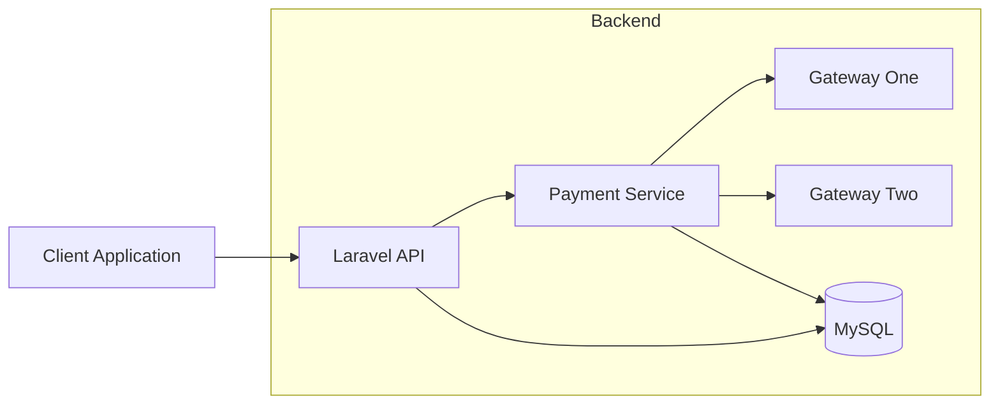
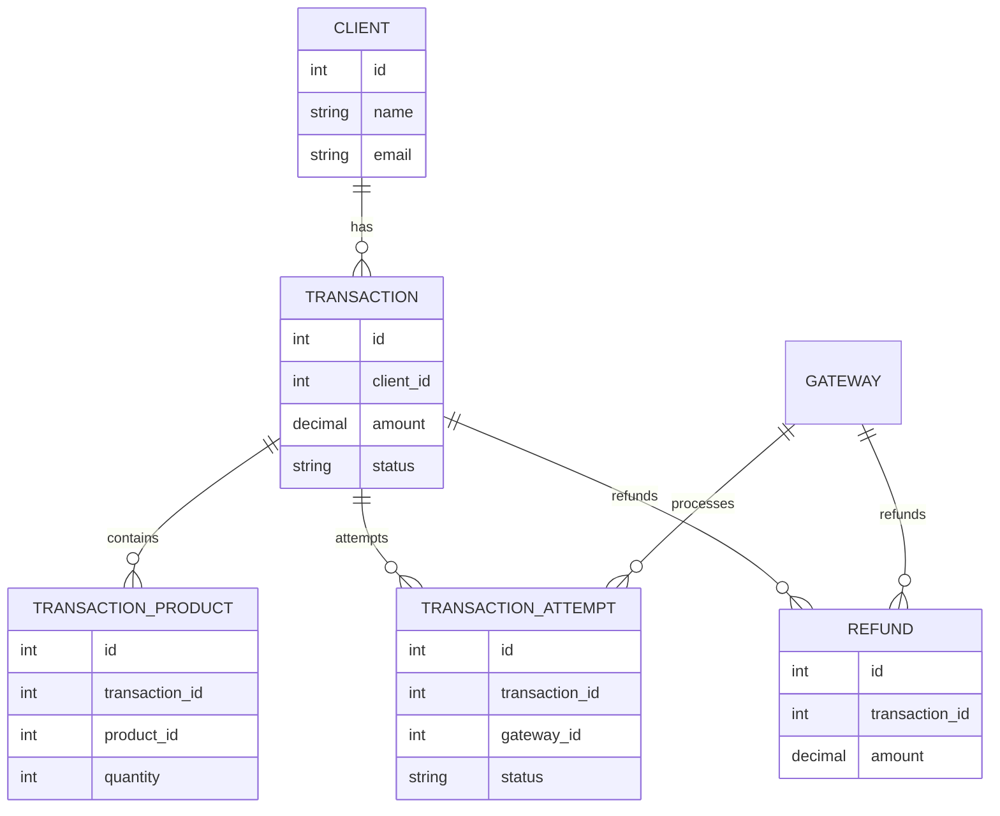
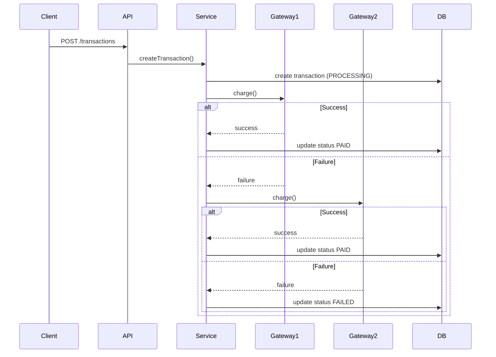
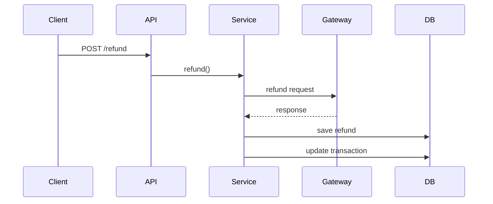

# BeMobile Backend Challenge


API RESTful desenvolvida como solução para o **Teste Prático Backend da BeMobile — Nível 3**.

Sistema de **processamento de pagamentos com múltiplos gateways**, incluindo:

- fallback automático entre gateways
- controle de prioridade de gateways
- registro de tentativas de pagamento
- reembolsos totais e parciais
- autenticação e controle de permissões
- arquitetura extensível para novos gateways
- testes automatizados

---

# 📚 Sumário

- Visão Geral
- Arquitetura (C4 Simplificado)
- Estrutura do Projeto
- Modelagem do Banco
- Fluxo de Pagamento
- Fluxo de Reembolso
- Autenticação e Permissões
- Endpoints
- Testes Automatizados
- Setup do Projeto
- Docker
- Segurança
- Escalabilidade
- Decisões Técnicas
- Aderência ao Desafio
- Melhorias Futuras

---

# Visão Geral

A API fornece um backend completo para **gerenciamento de pagamentos com múltiplos gateways**.

Funcionalidades principais:

- autenticação de usuários
- gerenciamento de usuários
- gerenciamento de clientes
- gerenciamento de produtos
- gerenciamento de gateways
- criação de transações
- fallback automático entre gateways
- registro de tentativas de pagamento
- processamento de reembolsos
- controle de permissões baseado em roles
- auditoria completa das operações

---

# Arquitetura (C4 Simplificado)



## Arquitetura em Camadas

```text
Client Request
      │
      ▼
Controllers
      │
      ▼
Request Validation
      │
      ▼
Service Layer
      │
      ▼
Gateway Integration
      │
      ▼
Repository Layer
      │
      ▼
Database
```

| Camada | Responsabilidade |
|------|------|
Controllers | Entrada HTTP |
Requests | Validação |
Services | Regras de negócio |
Repositories | Persistência |
DTOs | Transporte de dados |
Enums | Estados do domínio |
Gateways | Integração externa |

---

# Estrutura do Projeto

```text
app
├── Contracts
│   ├── GatewayPaymentInterface.php
│   ├── GatewayRepositoryInterface.php
│   └── TransactionRepositoryInterface.php
│
├── DataTransferObjects
│   ├── GatewayChargeResult.php
│   ├── GatewayRefundResult.php
│   └── PaymentChargeData.php
│
├── Enums
│   ├── GatewayCodeEnum.php
│   ├── RefundStatusEnum.php
│   ├── TransactionAttemptStatusEnum.php
│   ├── TransactionStatusEnum.php
│   └── UserRoleEnum.php
│
├── Exceptions
│   └── GatewayIntegrationException.php
│
├── Http
│   ├── Controllers
│   │   └── Api
│   │       ├── AuthController.php
│   │       ├── ClientController.php
│   │       ├── GatewayController.php
│   │       ├── ProductController.php
│   │       ├── RefundController.php
│   │       ├── TransactionController.php
│   │       └── UserController.php
│   │
│   ├── Middleware
│   │   ├── RoleMiddleware.php
│   │   └── Authenticate.php
│   │
│   ├── Requests
│   │   ├── StoreTransactionRequest.php
│   │   ├── StoreRefundRequest.php
│   │   └── StoreUserRequest.php
│   │
│   └── Resources
│       ├── TransactionResource.php
│       ├── RefundResource.php
│       └── UserResource.php
│
├── Models
│   ├── Client.php
│   ├── Gateway.php
│   ├── Product.php
│   ├── Refund.php
│   ├── Transaction.php
│   ├── TransactionAttempt.php
│   ├── TransactionProduct.php
│   └── User.php
│
├── Repositories
│   └── Eloquent
│       ├── EloquentGatewayRepository.php
│       └── EloquentTransactionRepository.php
│
└── Services
    ├── Gateways
    │   ├── AbstractGatewayService.php
    │   ├── GatewayOneService.php
    │   └── GatewayTwoService.php
    │
    └── PaymentService.php
```

---

# Modelagem do Banco

## Entidades

```text
users
clients
products
gateways
transactions
transaction_products
transaction_attempts
refunds
```

## Diagrama ER



---

# Fluxo de Pagamento



Todas as tentativas são registradas em:

```
transaction_attempts
```

---

# Fluxo de Reembolso



---

# Autenticação e Permissões

Autenticação baseada em **Laravel Sanctum**.

Roles disponíveis:

```
ADMIN
MANAGER
FINANCE
USER
```

## Permissões

| Ação | ADMIN | MANAGER | FINANCE | USER |
|----|----|----|----|----|
Criar usuário | ✔ | ✔ | ✖ | ✖ |
Criar produto | ✔ | ✔ | ✔ | ✖ |
Criar cliente | ✔ | ✔ | ✔ | ✔ |
Criar transação | ✔ | ✔ | ✔ | ✔ |
Processar refund | ✔ | ✖ | ✔ | ✖ |

---

# Endpoints

## Auth

```
POST /api/v1/login
POST /api/v1/logout
GET /api/v1/user
```

## Users

```
GET /api/v1/users
POST /api/v1/users
PUT /api/v1/users/{id}
DELETE /api/v1/users/{id}
```

## Products

```
GET /api/v1/products
POST /api/v1/products
PUT /api/v1/products/{id}
DELETE /api/v1/products/{id}
```

## Clients

```
GET /api/v1/clients
POST /api/v1/clients
```

## Gateways

```
GET /api/v1/gateways
PATCH /api/v1/gateways/{id}/priority
PATCH /api/v1/gateways/{id}/active
```

## Transactions

```
POST /api/v1/transactions
GET /api/v1/transactions
GET /api/v1/transactions/{id}
```

## Refund

```
POST /api/v1/transactions/{transaction}/refund
```

---

# Testes Automatizados

Cobertura de testes:

```
Auth
AuthorizationRoles
Transactions
PaymentService
Refund
```

Executar testes:

```bash
docker exec -it bemobile_app php artisan test
```

Exemplo:

```
Tests: 68 passed
Assertions: 283
```

---

# Setup do Projeto

## Clonar repositório

```bash
git clone https://github.com/Henri-Di/bemobile-backend-challenge.git
cd bemobile-backend-challenge
```

## Subir containers

```bash
docker compose up -d --build
```

## Configurar ambiente

```bash
cp .env.example .env
```

## Instalar dependências

```bash
docker exec -it bemobile_app composer install
```

## Gerar chave

```bash
docker exec -it bemobile_app php artisan key:generate
```

## Rodar migrations

```bash
docker exec -it bemobile_app php artisan migrate --seed
```

Aplicação disponível em:

```
http://localhost:9000
```

---

# Docker

Containers utilizados:

```
bemobile_app
bemobile_mysql
bemobile_nginx
```

Comandos:

```bash
docker compose up -d
docker compose down
```

---

# Segurança

Boas práticas aplicadas:

- validação de payload
- mascaramento de dados sensíveis
- autenticação via token
- controle de permissões
- tratamento de exceções
- separação de responsabilidades

---

# Escalabilidade

A arquitetura permite evoluir para:

- filas assíncronas
- circuit breaker para gateways
- novos provedores de pagamento
- observabilidade e métricas
- idempotência de pagamentos

---

# Decisões Técnicas

### Interface de Gateway

Permite adicionar novos gateways sem alterar o `PaymentService`.

### Service Layer

Centraliza regras de negócio.

### Repository Pattern

Isola acesso ao banco.

### DTO

Evita acoplamento entre camadas.

### Registro de Tentativas

Permite auditoria completa das transações.

---

# Aderência ao Desafio

| Requisito | Status |
|------|------|
API REST | ✔ |
MySQL | ✔ |
Docker | ✔ |
Múltiplos gateways | ✔ |
Fallback automático | ✔ |
Reembolso | ✔ |
Controle de roles | ✔ |
Testes automatizados | ✔ |
Arquitetura extensível | ✔ |

---

# Melhorias Futuras

```
OpenAPI / Swagger
Circuit breaker
Filas assíncronas
Observabilidade
Métricas
Idempotência de pagamentos
```

---

# Autor

Matheus Diamantino

Teste Técnico Backend — BeMobile