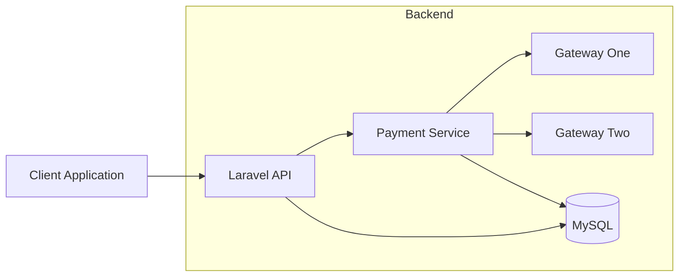
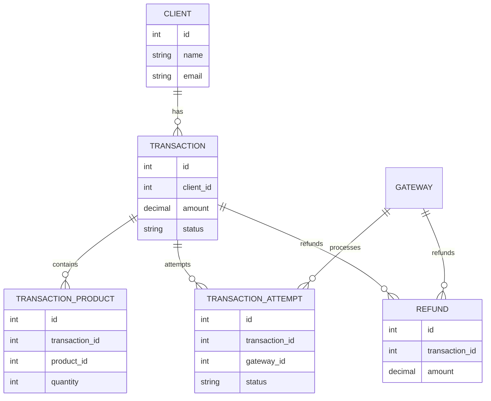
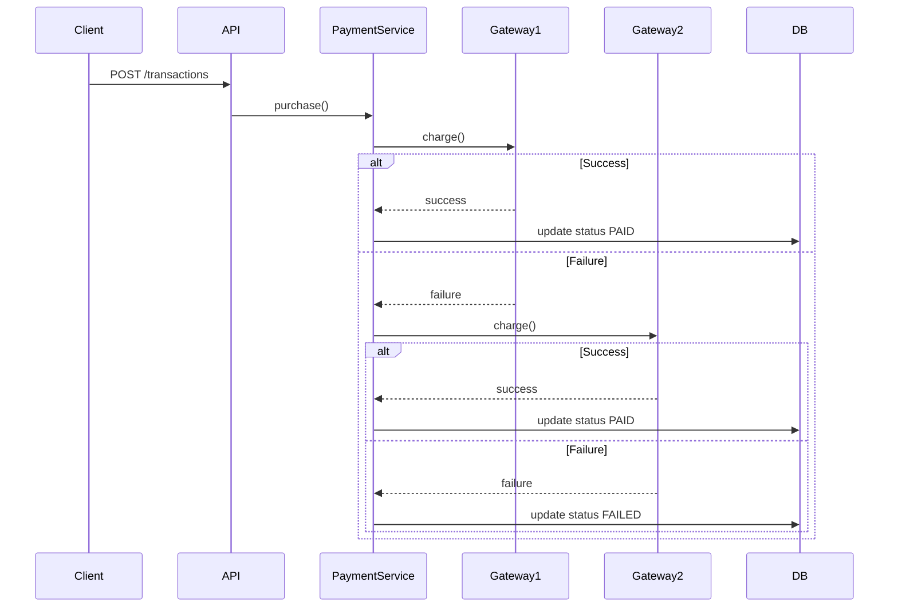
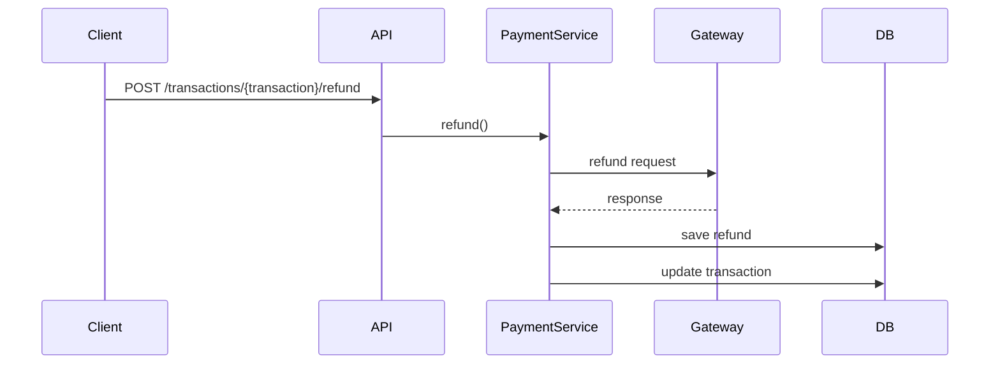

# BeMobile Backend Challenge


API RESTful desenvolvida como solução para o **Teste Prático Backend da BeMobile — Nível 3**.

Este projeto implementa um sistema de **processamento de pagamentos resiliente**, com suporte a múltiplos gateways, fallback automático, auditoria completa de tentativas e suporte a reembolso total ou parcial.

A aplicação foi projetada com foco em:

- arquitetura modular
- separação clara de responsabilidades
- extensibilidade para novos gateways
- resiliência na comunicação com provedores
- testes automatizados
- segurança e rastreabilidade das operações

---

# 📚 Sumário

- Visão Geral
- Arquitetura (C4 Simplificado)
- Arquitetura em Camadas
- Estrutura do Projeto
- Modelagem do Banco
- Diagrama ER
- Fluxo de Pagamento
- Fluxo de Reembolso
- Autenticação e Permissões
- Endpoints
- Exemplos de Requisição
- Testes Automatizados
- Setup do Projeto
- Docker
- Segurança
- Escalabilidade
- Decisões Técnicas
- Aderência ao Desafio
- Melhorias Futuras

---

# Visão Geral

A API fornece um backend completo para **gerenciamento de pagamentos com múltiplos gateways**.

Funcionalidades principais:

- autenticação de usuários
- gerenciamento de usuários
- consulta de clientes
- gerenciamento de produtos
- gerenciamento de gateways
- criação de transações
- fallback automático entre gateways
- registro de tentativas de pagamento
- processamento de reembolsos
- controle de permissões baseado em roles
- auditoria completa das operações

---

# Arquitetura (C4 Simplificado)



---

# Arquitetura em Camadas

```text
Client Request
      │
      ▼
Controllers
      │
      ▼
Form Requests
      │
      ▼
Service Layer
      │
      ▼
Gateway Integration
      │
      ▼
Eloquent ORM
      │
      ▼
MySQL Database
```

| Camada | Responsabilidade |
|------|------|
| Controllers | Entrada HTTP e orquestração |
| Requests | Validação de dados |
| Services | Regras de negócio |
| Gateways | Integração com provedores de pagamento |
| DTOs | Transporte estruturado de dados |
| Enums | Estados do domínio |
| Models | Persistência via Eloquent |

---

# Estrutura do Projeto

```text
app
├── Contracts
│   └── GatewayPaymentInterface.php
│
├── DataTransferObjects
│   ├── GatewayChargeResult.php
│   ├── GatewayRefundResult.php
│   └── PaymentChargeData.php
│
├── Enums
│   ├── GatewayCodeEnum.php
│   ├── RefundStatusEnum.php
│   ├── TransactionAttemptStatusEnum.php
│   ├── TransactionStatusEnum.php
│   └── UserRoleEnum.php
│
├── Exceptions
│   ├── GatewayIntegrationException.php
│   └── Handler.php
│
├── Http
│   ├── Controllers
│   │   └── Api
│   │       ├── AuthController.php
│   │       ├── ClientController.php
│   │       ├── GatewayController.php
│   │       ├── ProductController.php
│   │       ├── RefundController.php
│   │       ├── TransactionController.php
│   │       └── UserController.php
│   │
│   ├── Middleware
│   │   ├── Authenticate.php
│   │   └── RoleMiddleware.php
│   │
│   ├── Requests
│   │   ├── ClientIndexRequest.php
│   │   ├── GatewayIndexRequest.php
│   │   ├── ProductIndexRequest.php
│   │   ├── SetGatewayActiveRequest.php
│   │   ├── StoreProductRequest.php
│   │   ├── StoreRefundRequest.php
│   │   ├── StoreTransactionRequest.php
│   │   ├── StoreUserRequest.php
│   │   ├── TransactionIndexRequest.php
│   │   ├── UpdateGatewayPriorityRequest.php
│   │   ├── UpdateProductRequest.php
│   │   ├── UpdateUserRequest.php
│   │   └── UserIndexRequest.php
│   │
│   └── Resources
│       ├── ClientDetailResource.php
│       ├── ClientResource.php
│       ├── GatewayResource.php
│       ├── ProductResource.php
│       ├── RefundResource.php
│       ├── TransactionResource.php
│       └── UserResource.php
│
├── Models
│   ├── Client.php
│   ├── Gateway.php
│   ├── Product.php
│   ├── Refund.php
│   ├── Transaction.php
│   ├── TransactionAttempt.php
│   ├── TransactionProduct.php
│   └── User.php
│
└── Services
    ├── Gateways
    │   ├── AbstractGatewayService.php
    │   ├── GatewayOneService.php
    │   └── GatewayTwoService.php
    │
    └── PaymentService.php
```

---

# Modelagem do Banco

## Entidades

```text
users
clients
products
gateways
transactions
transaction_products
transaction_attempts
refunds
```

---

# Diagrama ER



---

# Fluxo de Pagamento



Todas as tentativas são registradas em:

```
transaction_attempts
```

---

# Fluxo de Reembolso



---

# Autenticação e Permissões

Autenticação baseada em **Laravel Sanctum**.

Roles disponíveis:

```
ADMIN
MANAGER
FINANCE
USER
```

## Permissões

| Ação | ADMIN | MANAGER | FINANCE | USER |
|----|----|----|----|----|
| Criar usuário | ✔ | ✔ | ✖ | ✖ |
| Criar produto | ✔ | ✔ | ✔ | ✖ |
| Criar cliente | ✔ | ✔ | ✔ | ✔ |
| Criar transação | ✔ | ✔ | ✔ | ✔ |
| Processar refund | ✔ | ✖ | ✔ | ✖ |

---

# Endpoints

## Auth

```
POST /api/v1/login
POST /api/v1/logout
GET /api/v1/user
```

## Users

```
GET /api/v1/users
GET /api/v1/users/{user}
POST /api/v1/users
PUT /api/v1/users/{user}
PATCH /api/v1/users/{user}
DELETE /api/v1/users/{user}
```

## Products

```
GET /api/v1/products
GET /api/v1/products/{product}
POST /api/v1/products
PUT /api/v1/products/{product}
PATCH /api/v1/products/{product}
DELETE /api/v1/products/{product}
```

## Clients

```
GET /api/v1/clients
GET /api/v1/clients/{client}
```

## Gateways

```
GET /api/v1/gateways
GET /api/v1/gateways/{gateway}
PATCH /api/v1/gateways/{gateway}/priority
PATCH /api/v1/gateways/{gateway}/active
```

## Transactions

```
POST /api/v1/transactions
GET /api/v1/transactions
GET /api/v1/transactions/{transaction}
```

## Refund

```
POST /api/v1/transactions/{transaction}/refund
```

---

# Exemplos de Requisição

## Criar Transação

```json
{
  "customer": {
    "name": "João Silva",
    "email": "joao@email.com"
  },
  "items": [
    {
      "product_id": 1,
      "quantity": 2
    }
  ],
  "card": {
    "number": "4111111111111111",
    "holder_name": "João Silva",
    "expiration": "12/30",
    "cvv": "123"
  }
}
```

---

# Testes Automatizados

Executar testes:

```bash
docker exec -it bemobile_app php artisan test
```

Resultado atual:

```
Tests: 68 passed
Assertions: 283
```

Cobertura inclui:

- autenticação
- autorização
- criação de transação
- fallback de gateway
- validação de payload
- listagem e detalhe de transações
- reembolso total e parcial

---

# Setup do Projeto

```bash
git clone https://github.com/Henri-Di/bemobile-backend-challenge.git
cd bemobile-backend-challenge

docker compose up -d --build

cp .env.example .env

docker exec -it bemobile_app composer install
docker exec -it bemobile_app php artisan key:generate
docker exec -it bemobile_app php artisan migrate --seed
```

Aplicação disponível em:

```
http://localhost:9000
```

---

# Docker

Containers utilizados:

```
bemobile_app
bemobile_mysql
bemobile_nginx
bemobile_gateway_mock
```

---

# Segurança

Boas práticas aplicadas:

- validação de payload via Form Requests
- mascaramento de dados sensíveis
- autenticação baseada em token
- controle de permissões por role
- tratamento centralizado de exceções
- separação de responsabilidades

---

# Escalabilidade

A arquitetura permite evoluir para:

```
filas assíncronas
circuit breaker para gateways
novos provedores de pagamento
observabilidade
métricas
idempotência de pagamentos
```

---

# Decisões Técnicas

### Interface de Gateway

Permite adicionar novos gateways sem alterar o `PaymentService`.

### Service Layer

Centraliza regras de negócio.

### DTO

Evita acoplamento entre camadas.

### Registro de Tentativas

Permite auditoria completa das transações.

### Fallback de Gateways

Sistema tenta automaticamente o próximo gateway disponível baseado na prioridade.

---

# Aderência ao Desafio

| Requisito | Status |
|------|------|
| API REST | ✔ |
| MySQL | ✔ |
| Docker | ✔ |
| Múltiplos gateways | ✔ |
| Fallback automático | ✔ |
| Reembolso | ✔ |
| Controle de roles | ✔ |
| Testes automatizados | ✔ |
| Arquitetura extensível | ✔ |

---

# Melhorias Futuras

```
OpenAPI / Swagger
Circuit breaker
Filas assíncronas
Observabilidade
Métricas
Idempotência de pagamentos
```

---

# Autor

Matheus Diamantino

Teste Técnico Backend — BeMobile